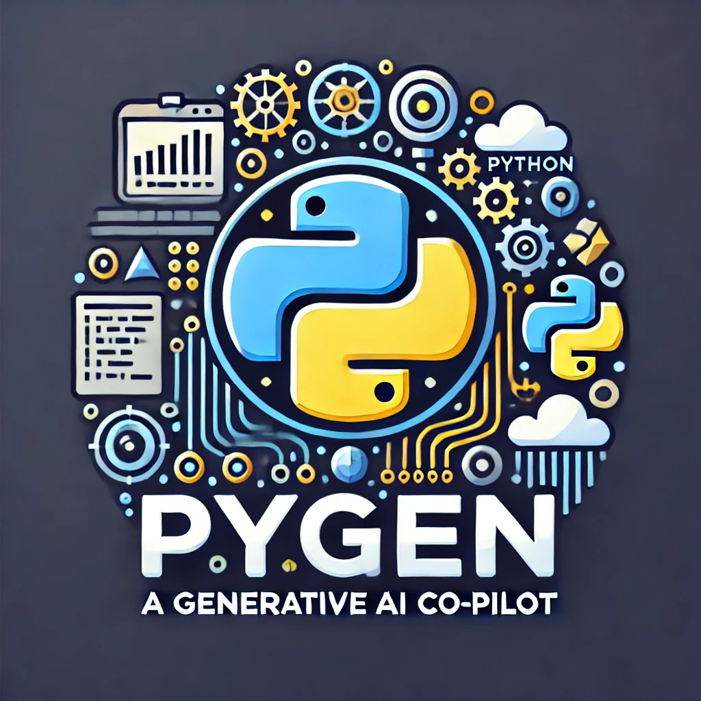

<!-- PROJECT LOGO -->
<figure markdown style="text-align: center">
  
</figure>

PyGen is a Python Generative AI Co-pilot designed to enhance productivity and streamline development processes for
Python developers. This tool leverages state-of-the-art large language models (LLMs) such as GPT-4 and Claude 3.5 
Sonnet to provide advanced features, including intelligent code and test generation, refactoring, linting, static 
analysis, and more. PyGen aims to offer a robust development experience powered by the latest advancements in AI.

## Features

- **Convert**: Convert various file types into Python code.
- **Explain**: Provide detailed explanations for the Python codebase, modules, classes, or functions.
- **Generate**: Automatically generate Python tests or docstrings for modules, classes, or functions.
- **Git**: Perform Git operations such as checking staged changes, generating commit messages, or creating pull request
messages.
- **Refactor**: Refactor Python code including modules, classes, or functions to improve structure and readability.
- **Resolve**: Resolve issues detected by Python tools like Bandit, Flake8, Pylint, and Mypy.
- **Review**: Review the codebase, modules, classes, or functions and suggest improvements.
- **Traceback**: Provide guidance and suggestions to resolve Python traceback errors.

## Installation

To install PyGen, use pip:

```sh
pip install pygen
```

## Environment Setup

PyGen requires an environment file (.env) in the root directory with the following AWS credentials to access a Large 
Language Model (LLM) on AWS Bedrock:

```sh
AWS_ACCESS_KEY_ID=<your_access_key_id>
AWS_SECRET_ACCESS_KEY=<your_secret_access_key>
```

Ensure you have set up an LLM on AWS Bedrock and provide the above keys in the .env file.

## Usage

PyGen is a Python Typer command-line interface (CLI) tool. Below are some examples of how to use it:

### Global Options

You can set the logging level using the `--level` option:

```sh
pygen --level [DEBUG|INFO|WARNING|ERROR]
```

### Convert

Convert various file types into Python code:

```sh
pygen convert <file_path>
```

### Explain

Get detailed explanations for your code:

```sh
pygen explain codebase
pygen explain module <module_name>
pygen explain class <class_name>
pygen explain function <function_name>
```

### Generate

Generate code, tests, and docstrings:

```sh
pygen generate tests module <module_name>
pygen generate tests class <class_name>
pygen generate tests function <function_name>
pygen generate docstring module <module_name>
pygen generate docstring class <class_name>
pygen generate docstring function <function_name>
```

### Git

Perform Git operations:

```sh
pygen git check
pygen git commit
pygen git pr

```

### Refactor

Refactor your Python code:

```sh
pygen refactor module <module_name>
pygen refactor class <class_name>
pygen refactor function <function_name>
```

### Resolve

Resolve issues detected by Python tools:

```sh
pygen resolve bandit
pygen resolve flake8
pygen resolve pylint
pygen resolve mypy
```

### Review

Review and suggest improvements for your code:

```sh
pygen review codebase
pygen review module <module_name>
pygen review class <class_name>
pygen review function <function_name>
```

### Traceback

Provide guidance and suggestions to resolve Python traceback errors:

```sh
pygen traceback
```

## Contributing

We welcome contributions to PyGen! If you would like to contribute, please follow these steps:

1. Fork the repository.
2. Create a new branch (`git checkout -b feature-branch`).
3. Make your changes.
4. Commit your changes (`git commit -m 'Add new feature'`).
5. Push to the branch (`git push origin feature-branch`).
6. Open a pull request.

Please ensure your code adheres to our coding standards and includes appropriate tests.

## Support

If you encounter any issues or have questions about PyGen, please feel free to open an issue in the GitHub repository or
contact the maintainer:

- Maintainer: Chris Jackett
- Email: chris.jackett@csiro.au

## License

This project is licensed under the MIT License. See the [LICENSE](LICENSE) file for more details.

## Status

This project is currently in development. We appreciate your feedback and contributions as we continue to improve PyGen.
